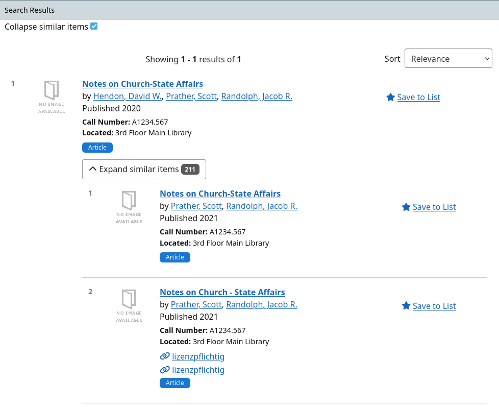
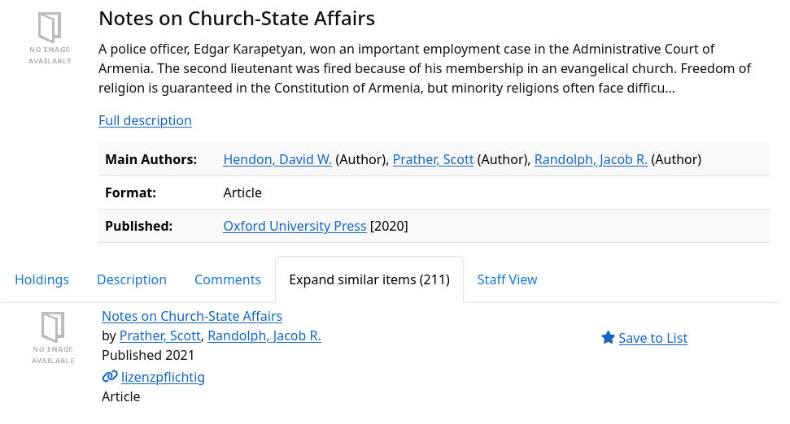

[](https://github.com/ubtue/vufind-collapse-expand/actions/workflows/ci.yaml)
# VuFindCollapseExpand module for VuFind

This module is based on the [vufind-result-grouping module](https://git.sc.uni-leipzig.de/ubl/finc/packages/vufind-results-grouping/). It uses [Apache Solr's Collapse and Expand Results](https://solr.apache.org/guide/solr/latest/query-guide/collapse-and-expand-results.html) instead of [Result Grouping](https://solr.apache.org/guide/solr/latest/query-guide/result-grouping.html).

## Screenshots

### Result List



### Record Tab



## Enabling the module

Here is the step by step to enable this module:

1. Add the following line to `composer.json`:
    `"ubtue/vufind-collapse-expand": "@dev"`
    Note that a more concise versioning schema will be introduced as soon as the first release is created (for matching VuFind version).

2. Update composer package (via terminal):
    `composer update`

3. Add the module to `application.config.php` in the config folder.

    ```
    $module = [
    ...
    'VuFindCollapseExpand',
    ...
    ]
    ```

    For advanced users, it's also possible to copy the into `modules` and enable it in `httpd-vufind.conf`.
    But then you need to care about updates yourself.

4. Add the trait
    In your record driver `RecordDriver/SolrDefault` (ex. RecordDriver/SolrDefault.php), there are several changes necessary:

    ```php
    class SolrDefault extends \VuFind\RecordDriver\SolrMarc implements \VuFindCollapseExpand\Config\CollapseExpandConfigAwareInterface
    {
        ...
        use \VuFindCollapseExpand\RecordDriver\Feature\CollapseExpandTrait;
        use \VuFindCollapseExpand\Config\CollapseExpandConfigAwareTrait;
        ...
    }
    ```

5. Add the config to `config.ini`
    ```ini

    ; When the collapse.field is set, the feature itself is enabled.
    ; With activated_by_default you can preset the users activation choice 
    ; The collapse.field is recommended to set the same value with expand.field
    ; If you want to override defaults / use specific features, please have a look at the Solr Documentation:
    ; https://solr.apache.org/guide/solr/latest/query-guide/collapse-and-expand-results.html
    ; mandatory collapse fields are collapse.field, expand.field and expand.rows.
    [CollapseExpand]
    ; activated_by_default sets the initial state of the grouping (default = true)
    ; users can override this by clicking the checkbox
    activated_by_default = true
   
    collapse.field = title_sort
    ;collapse.min =
    ;collapse.max =
    ;collapse.sort =
    ;collapse.nullPolicy = ignore
    ;collapse.hint =
    ;collapse.size = 100000
    ;collapse.collectElevatedDocsWhenCollapsing = true

    expand.field = title_sort
    expand.rows = 500
    ;expand.sort = score desc
    ;expand.q =
    ;expand.fq =
    ;expand.nullGroup = false
    ```

6. User Interface - HTML
    **Mixin**

    Add the mixin to your custom theme by referencing it in your `theme.config.php`:
    `'mixins' => ['vufind-collapse-expand']`

    Experimental: The corresponding folder should be auto-created during composer installation, but if they are missing, just copy them manually from or create a symlink to:
    `vendor/ubtue/vufind-collapse-expand/res/theme` => `themes/vufind-collapse-expand`

    The following sections contain information about how to include certain snippets. You might as well also extend/override them in your own theme if necessary.

    **Checkbox**

    Add a reference in your search/results.phtml to the result-list-snippet.phtml
    Copy the code in the file `res/theme/templates/search/controls/collapse_expand.html` where you want the checkbox for enabling/ disabling CollapseExpand dynamically, for example in `[your_theme]/templates/search/results.html`

    **Result list**

    Add a reference in your result-list.phtml to the result-list-snippet.phtml
    `<?=$this->render('RecordDriver/DefaultRecord/result-list-snippet.phtml')?>`

    A good point for adding this include would be at the bottom of `<div class="media-body">`, right before the `</div>`.

    **Record Tab**

    CollapseExpand comes with a record tab called `Other Document` to show the expand documents when user access the detail information of the record. Using the feature is simple, just follow the instruction below to activate.

    `RecordTabs.ini` (`config/vufind/RecordTabs.ini`)
    ```ini
    [VuFind\RecordDriver\SolrMarc]
    ...
    tabs[CollapseExpand] = CollapseExpand
    ...
    ```

    **Language Translation**

    Adding the translation into `[language].ini` for example the english translation:

    ```ini
    ...
    collapse results = "Collapse similar items"
    expand results = "Expand similar items"
    ```

    Note: This might not be necessary if the mixin is included properly, unless you want to override the default display texts.

## Enabling the VuFindCollapseExpand module along custom code modules

The VuFindCollapseExpand module extends several VuFind classes. Therefore, if you have added a module with custom code to your VuFind installation which customizes any of the following classes you need to list the VuFindCollapseExpand module in the `application.config.php` prior to your custom module and alter the inheritance references to the VuFindCollapseExpand module accordingly.

VuFind classes extended in VuFindCollapseExpand module:

```php
\VuFind\AjaxHandler\AbstractBase
\VuFind\Controller\SearchController
\VuFind\Search\Factory\AbstractSolrBackendFactory
\VuFind\Search\Solr\Params
\VuFind\ServiceManager\ServiceInitializer
\VuFindSearch\Backend\Solr\Backend
\VuFindSearch\Backend\Solr\Response\Json\RecordCollection
```

## Notes on Solr field types / Indexing

For a quick & dirty test with the `biblio` index, you can just use the default `title_sort` field for `collapse.field` as well as `expand.field`.
For debugging, it might also make sense if you enable a facet for this field in `facets.ini`. This way you can easily find similar records that will be affected by the functionality. Note that the shown numbers in the facet will only make sense if collapse is disabled, else you will only see count=1 for every facet entry.

For productive use, it usually makes sense to define a custom field for this in your index, and also use a custom java import routine that combines multiple parts of your metadata.
Unfortunately Collapse & Expand only supports `Solr.StrField`, so we cannot use Tokenizers & Filters like in `Solr.TextField`.
For the import, a good point to get started is to look at the default optional `work_keys_str_mv` field. However, since Collapse & Expand works only on single-valued fields, there will be some adjustments needed.

```
work_keys_str_mv = custom, getWorkKeys(130anp:730anp, 240anpmr:245abn:246abn:247abn, 240anpmr:245abn, 100ab:110ab:111ac:700ab:710ab:711ac, "", "", ":: NFD; :: lower; :: Latin; :: [^[:letter:] [:number:]] Remove; :: NFKC;")
```

Note that this field already uses normalizations like lowercase, removing all non-letters & numbers, and NFD/NFKC Unicode Normalization. Additional information can be found in the [VuFind Wiki](https://vufind.org/wiki/configuration:record_versions), which also contains information about other similar mechanisms like FRBR.

Another option might be to take a multi-layered approach:
- Search for persistent identifiers (e.g. DOI, LCCN, ...), and skip the regular hashing if at least one persistent identifier is available
    - This only makes sense if you have high metadata quality and all entries of your potential groups contain the same identifier. For example, if you want to collapse print/online records, and e.g. DOIs are only present in your online records, you might need additional preprocessing).
- As fallback, build a custom hash similar to `work_keys_str_mv` (e.g. title, subtitle, authors, ...) or even call `getWorkKeys()` and check whether more normalization is needed.
    - Since getWorkKeys() works with a multiValued field, you might need to concatenate the returned values into a single has
    - In addition, you could append the `format` field at the end of your hash with a delimiter to avoid books being collapsed with articles in some edge cases, and so on.

Experimental: If you really have a big index and run into performance problems, Collapse & Expand in theory also supports Int + Float based data types. So you could try to define Int-based group IDs based on your hash. This could lead to slow indexing, but very fast queries.
